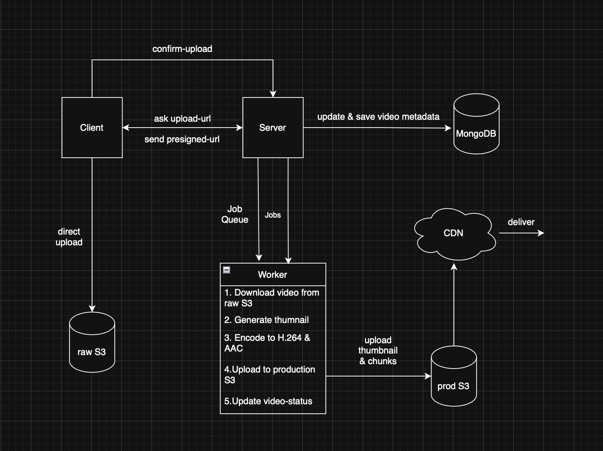

# StreamIt Backend

A scalable video processing backend powering StreamIt.  
Handles video uploads, asynchronous processing, and streaming delivery.

---

## Tech Stack

- Node.js
- AWS S3
- FFmpeg
- BullMQ (queue + worker)
- Redis
- MongoDB

---

## Features

- JWT-based authentication
- Presigned URL generation for direct S3 uploads
- Asynchronous video processing pipeline (FFmpeg)
- HLS (HTTP Live Streaming) generation
- Background job processing with Redis + BullMQ
- Video status tracking (PROCESSING → COMPLETED → FAILED)
- Search videos by title
- Protected routes & middleware

---

## Architecture Highlights

- Queue-based processing (decoupled API & worker)
- Distributed video processing using worker nodes
- Fault-tolerant job handling with retries
- Efficient media delivery via S3 + HLS